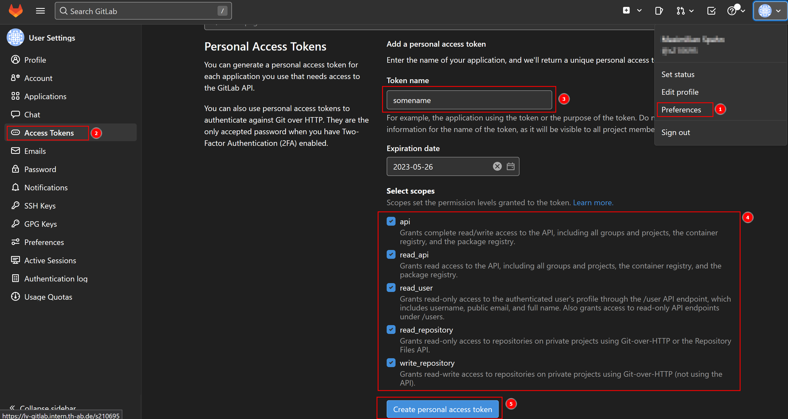
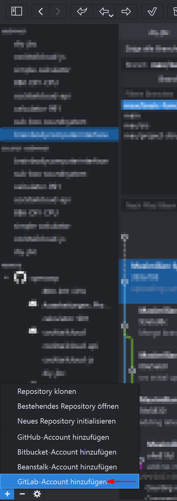
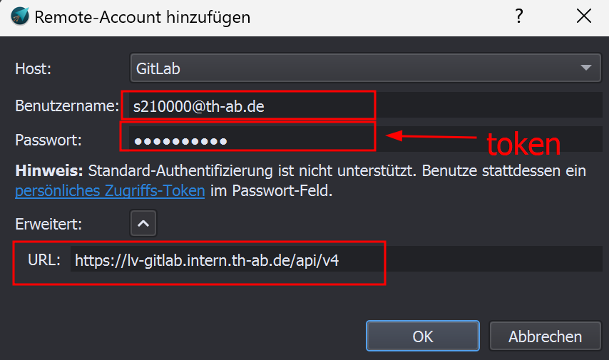
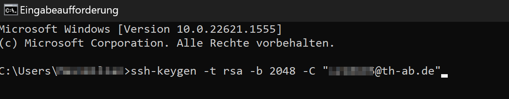
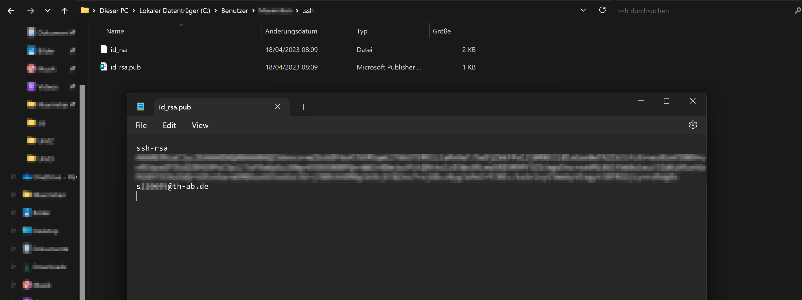
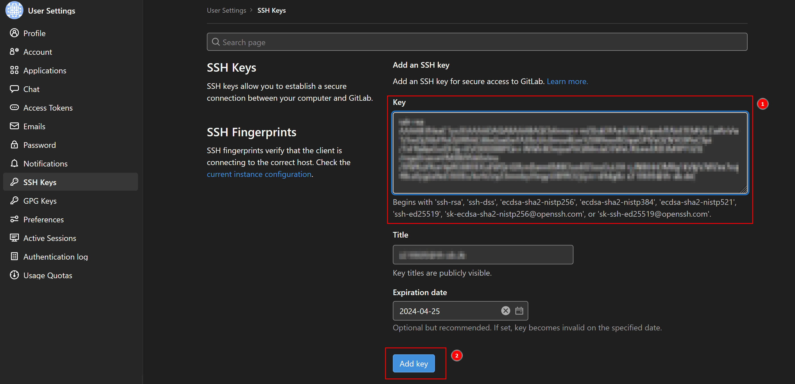
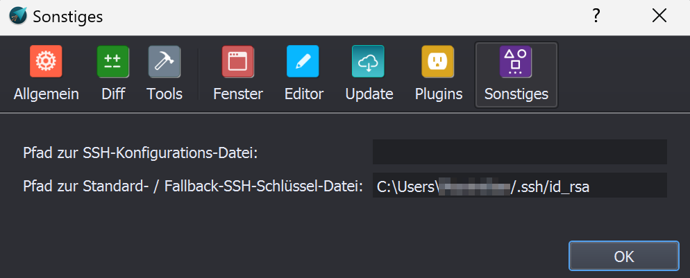

# Kleine Anleitung zur Benutzung von Git mit GitAhead

Um Git ein wenig einfacher zu machen ist GitAhead sinnvoll...
GitAhead gibt es für Windows Linux und Mac

### Einrichtung GitAhead

## Token erstellen

 

 wichtig: den token gleich kopieren (man sieht den nur einmal)

## GitAhead anmelden
 
 Wenn GitAhead gestartet:

 

 Th-Email, Token, und Server angeben

 

## SSH Keys

 Am Einfachsten wenn MSYS2 schon installiert ist. 
 Dann ist nämlich auch unter Windows der Befehl "ssh-keygen" möglich.

 

 Den Key in der "id_rsa.pub" öffnen und kopieren

 

 Den Key in Gitlab einfügen

 

 In GitAhead den Ort für den Key angeben (unter Extras->Optionen->Sonstiges)

 