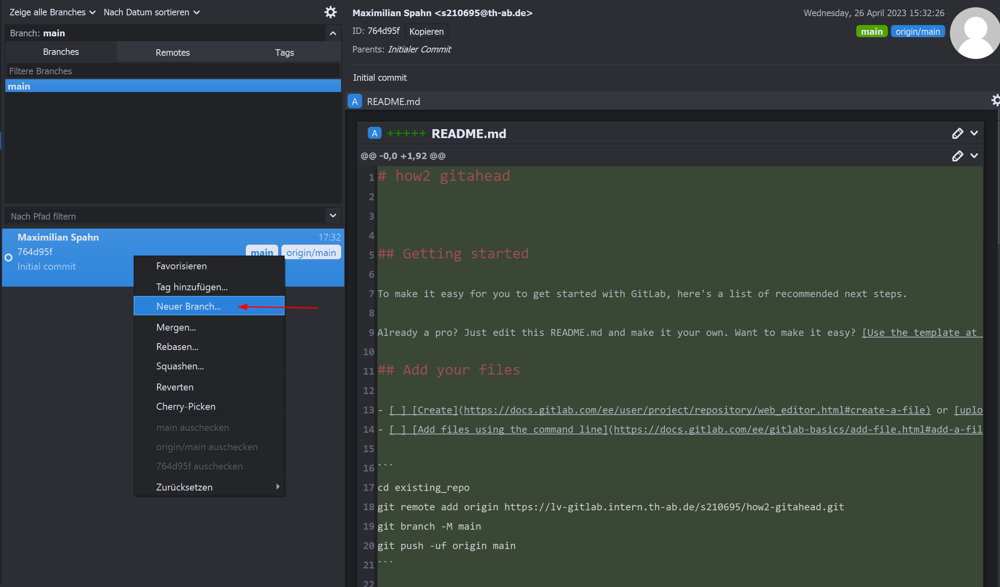
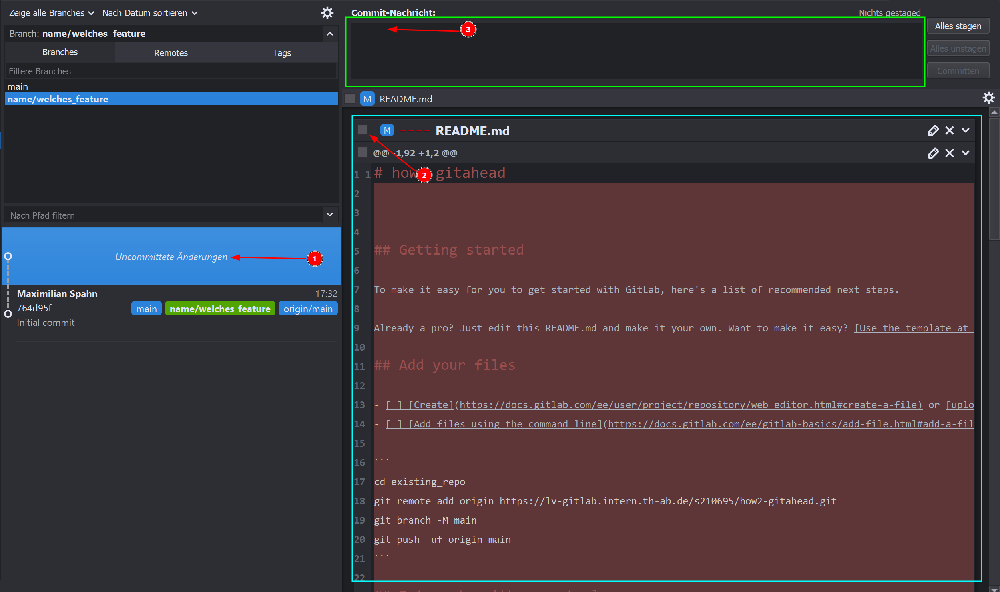

# Kleine Anleitung zur Benutzung von Git mit GitAhead

Um Git ein wenig einfacher zu machen ist GitAhead sinnvoll...
GitAhead gibt es für Windows Linux und Mac

## Einrichtung GitAhead

### Token erstellen

 - Damit GitAhead auf unseren GitLab Account zugreifen kann, benötigen wir einen Token welchen wir anstelle eines Passworts in GitAhead benutzen können

 

 
 

 - wichtig: den token gleich kopieren (man sieht den nur einmal)

### GitAhead anmelden

 - Wenn GitAhead gestartet ist, kann man den Token wie gezeigt verwenden:

 

 
 

 - hier die TH-Email, und den Token angeben.
 - auch muss die Server URL angepasst werden um den GitLab Server der TH zu verwenden

 

 
 

### SSH Keys

 - Als nächstes benötigen wir einen SSH Key um auf dem Server hochzuladen und runterzuladen
 - Der Key kann über Putty generiert werden oder über "ssh-keygen"
 - Am Einfachsten ist aber über MSYS2 (da wir das eh schon benutzen). Mit MSYS ist nämlich auch unter Windows der UNIX-Befehl "ssh-keygen" möglich.

 

 
 

 - wenn nach einer passphrase gefragt wird kann man diese auch einfach lehr lassen ;-)

 - Der Public key ist in "id_rsa.pub" die Datei kann man einfach mit einem Editor öffnen und den kompletten Inhalt kopieren

 

 
 

 - Den Key in Gitlab einfügen

 

 
 

 - Damit auch GitAhead den Key kennt muss der Pfad für das keypair angegeben werden (unter Extras->Optionen->Sonstiges)

 

 
 

## Repository Klonen

 - ist GitAhead eingerichtet kann das Repo geklont werden

 - dazu muss der link den Repos von der entsprechenden Git-Page kopiert werden

 - es wird der Link für "Clone with SSH" benötigt

 

 
 

 - dann kann das Repo wie in den Screenshots geklont werden
 - (den Speicherort am besten anpassen) (und merken)

 

 
 

 

 
 

 

 
 

## Entwicheln eines Features

 - Da wir mit Branches arbeiten wollen wird es hier ein wenig schwieriger als nötig
 - Der Zweck von branches ist es immer eine lauffähige Version auf "main" zu haben

### Wtf ist ein Branch

 > - Ein Branch ist eine Kopie des Codes, die von einem Haupt-Code-Repository erstellt wird. 
 > - Das Erstellen eines Branches ermöglicht es dir, Änderungen am Code vorzunehmen, ohne den Haupt-Code zu beeinträchtigen. 
 > - Wenn du deine Arbeit auf einem Branch abgeschlossen hast, kannst du deine Änderungen in den Haupt-Code-Repository (auch als "Merge" oder "Merge Request" bezeichnet) einfügen, damit sie in den Haupt-Code integriert werden können.
 > 
 >   _~ ChatGPT_

 - Am besten stimmen die Branches mit den Aufgaben auf dem Jira-Board überein

### Erstellen eines Branches

 - Um alle Branches angezeigt zu bekommen muss man zuerst auf das Dropdown Menü klicken

 

 
 

 - Mit Doppelklick auf "main" sicherstellen das der main branch der aktuelle ausgecheckte branch ist.

 

 
 

 - Der Aktuelle branch ist immer der grün markierte.

 - Achtung: der aktuell augecheckte branch lässt sich nicht ändern wenn noch uncommited changes vorhanden sind

 - Anschließend kann noch der aktuelle Stand des main branchs heruntergeladen also gepullt werden

 - Jetzt kann von main ein neuer branch erstellt werden (also rechtsklick auf den letzten commit und dann "Neuer Branch") (ab diesem Punkt wird eine Kopie von main erstellt)

 

 
 

 

 
 

 - Der neue branch ist jetzt ausgewählt und kann bearbeitet werden

 - Sind Änderungen gemacht können diese commited werden

 - Wenn man links auf "Uncommittete Änderungen" klickt sieht man rechts alle gemachten Änderungen

 - Durch anklicken der Checkboxes werden die Änderungen ausgewählt die commited werden sollen (gestaged)

 - Dann kann ein Commit-Message eingegeben werden und mit "Commit" bestätigt werden

 

 
 

 

 
 

 - Hier wird als Beispiel eine weitere Änderung gemacht und commited

 

 
 

 - Wenn alle Änderungen commited sind kann der branch gepusht werden

 

 
 

 - Beim Puschen kann ein Fehler angezeigt werden, dass kein remote branch gefunden wurde

 - Durch anklicken des obernen Links kann der branch auf den remote gepusht werden, wobei der remote branch automatisch erstellt wird

 

 
 

 - Der branch ist jetzt auf dem remote und kann auf der Gitlab Seite eingesehen werden

 - Wenn die Änderungen fertig sind kann ein Merge Request erstellt werden

 - Bei einem Merge Request wird der aktuelle branch mit dem main branch gemerged (zusammengeführt)

 - Dazu muss auf der Gitlab Seite auf "Merge Request" geklickt werden

 

 
 

 - Hier wird der aktuelle branch ausgewählt und der main branch als Ziel

 

 
 

 - Dann kann der Merge Request erstellt werden

 

 
 

 - Der Merge Request kann dann augeführt werden

 

 
 

 - Wenn man nun in GitAhead den main branch auswählt und auf "Pull" klickt werden die Änderungen vom remote heruntergeladen

 

 
 

 - Das Bild zeigt wie sich der main branch von main abspaltet, dann daran Anderungen gemacht weden und dann wieder mit main zusammengeführt wird

 

 
 

 - optional kann der branch noch gelöscht werden

 

 
 

 

 
 

